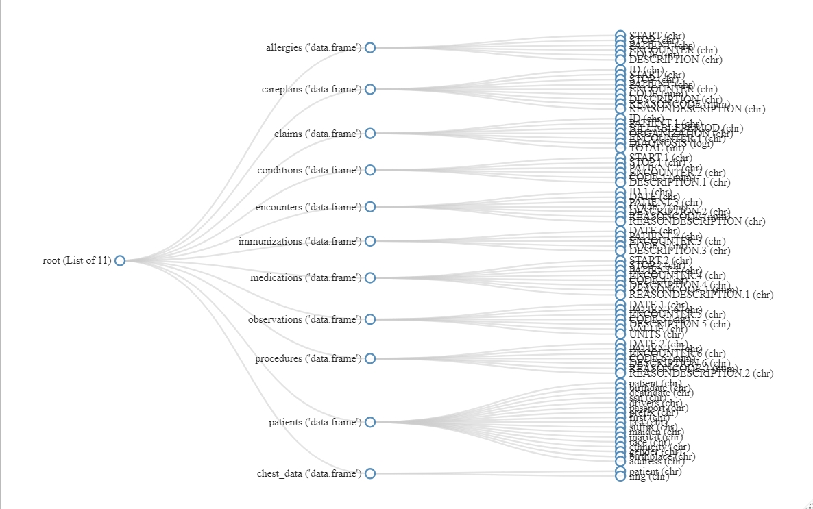

# `Patient Profile` 
PatientProfile is an application for an on-the-go access to all the medical records and history of a patient along with interactive visualizations and data analysis.
 

## Prerequisites for using PatientProfile
PatientProfile was built in [R](https://www.r-project.org) , an open source programming language using the [Shiny package](https://shiny.rstudio.com), a web application framework for R. Users will need to download [R](https://cran.uni-muenster.de/) in order to use RadaR and we suggest the use of [RStudio](https://www.rstudio.com). R is completely free to use. All required code can be found in this github repositroy.

## Input type for PatientProfile
The system makes use of .csv files already uploaded to the [data](./data/Patient%20Data/) folder and the end-user does not need to provide any additional data files.

### Input files

## Privacy and Storage
PatientProfile, currently, uses synthetically generated medical data. [Synthea](https://ecqi.healthit.gov/tool/synthea%E2%84%A2#:~:text=Synthea%E2%84%A2%20is%20an%20open,covering%20every%20aspect%20of%20healthcare.), a synthetic patient data generator that mimics the medical history of synthetic patients, was used to generate the data. Their objective is to provide high-quality synthetic patient data and linked health records that cover every element of healthcare.

## Author
PatientProfile was created as a part of the capstone project at Vellore Institute of Technology by [Ansh Pujara](https://github.com/anshpujara14/), student of Bachelor Of Technology in Computer Science Engineering.
